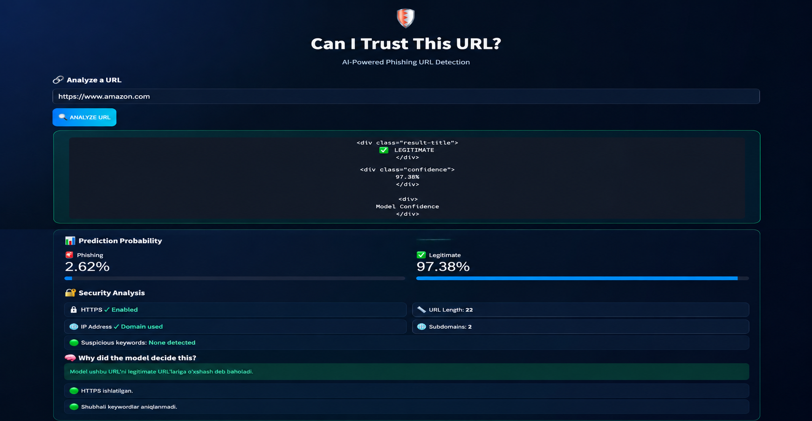

# 🛡️ Can I Trust This URL?

  

<h3 align="center">
AI-Powered Phishing URL Detection
</h3>

  <a href="https://canitrustthisurl.streamlit.app">
    🚀 Live Demo
  </a>

---

## 🌐 Live Demo

Try the application online:

👉 **https://canitrustthisurl.streamlit.app**

The application allows users to enter a URL and receive a Machine Learning prediction:

- ✅ Legitimate
- ⚠️ Phishing
- 📊 Prediction probability
- 🔐 HTTPS analysis
- 📏 URL structure analysis
- 🔎 Suspicious pattern detection

---

## 🎯 Project Overview

**Can I Trust This URL?** — foydalanuvchi kiritgan URL manzilni Machine Learning yordamida tahlil qilib, uni **Legitimate** yoki **Phishing** ekanligini aniqlaydigan web application.

The project uses:

**Character-level TF-IDF + Logistic Regression**

📊 Dataset

The project uses the UCI PhiUSIIL Phishing URL (Website) dataset.

235,795 instances

54 features

Raw URL available

Binary classification

No missing values

Target

1 → Legitimate
0 → Phishing

📈 Model Performance

After removing exact duplicate URLs and training the model:

| Metric    |       Score |
| --------- | ----------: |
| Accuracy  |  **99.63%** |
| Precision |  **99.35%** |
| Recall    | **100.00%** |
| F1 Score  |  **99.67%** |

🌐 Real-World Testing

The model was also tested on real websites including:

Google

GitHub

Python

Wikipedia

Microsoft

Apple

Amazon

Adobe

IBM

Intel

NVIDIA

LinkedIn

Reddit

Kun.uz

Real-world testing showed that some legitimate websites can still be classified incorrectly.

This demonstrates an important Machine Learning concept:
High test-set performance does not always guarantee perfect real-world generalization.

📁 Project Structure

Can_I_Trust_This_URL/
│

├── phishing_url_detection.ipynb

├── app.py

├── phishing_url_model.pkl

├── requirements.txt

├── README.md

│

└── images/
   └── img.png

